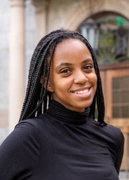

## About Me

  

  

Hi! My name is **Kaija Frierson**, and I am a third-year Honors Computer Science student at the University of Arkansas.  
My interests include **human–computer interaction**, **accessibility**, and **inclusive design**, especially supporting those with disabilities and/or diseases.

This year, I have been working on projects focused on accessible computer-science diagrams, tactile representations, and personalized information retrieval for users with diverse accessibility needs.

I am passionate about building technology that reduces barriers, empowers marginalized communities, and supports more equitable digital experiences.

  

## 💜 Research Interests

- Human–Computer Interaction (HCI)  
- Accessibility & Assistive Technologies  
- Inclusive Design  
- Computer Vision for diagrams  
- Information retrieval & personalization
- Augmented Reality (AR)

## 💜 News

- **[Aug 2025]** Started my third year in Computer Science at the University of Arkansas.
- **[Aug 2025]** Working on my Honors thesis on accessibility and search personalization.  
- **[Summer 2025]** Completed research at the UW DUB REU on accessible CS diagrams for blind/low-vision learners.  

## Contact

Feel free to reach out if you’d like to talk about accessibility, HCI research, or inclusive computing.

- **Email:** kaijaf@uark.edu  
- **LinkedIn:** www.linkedin.com/in/kaija-frierson  
